# **Android期中实验  **

## --NotePad记事本应用

### 学号：116052019053          姓名：王政


### 一、实现功能

#### 1.添加笔记时间戳

##### 实现效果：

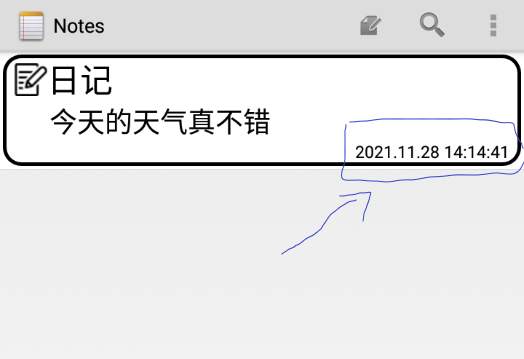

#### 2.笔记查询

##### 实现效果：

###### 1)选中放大镜图标进入查询界面

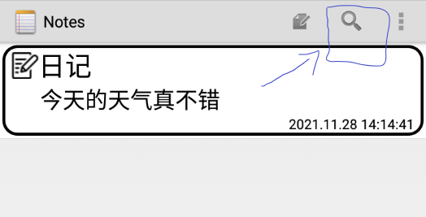


###### 2)初始查询界面

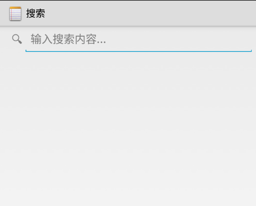


###### 3)输入内容后，删除输入内容，会显示所有笔记

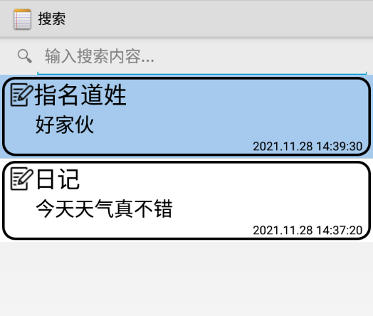


###### 4）输入搜索内容后，会对笔记的标题进行模糊查询，并自动显示符合的结果

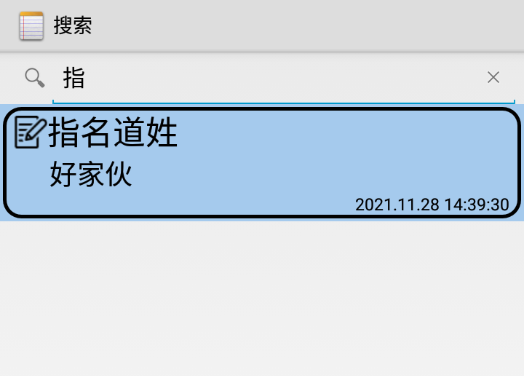

#### 3.笔记背景颜色切换

##### 实现效果：

###### 1)进入笔记编辑界面，点击如图所示的画笔进行笔记背景颜色的编辑

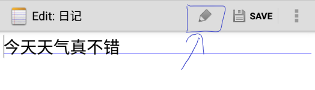

###### 2）选择任意颜色对背景进行填充

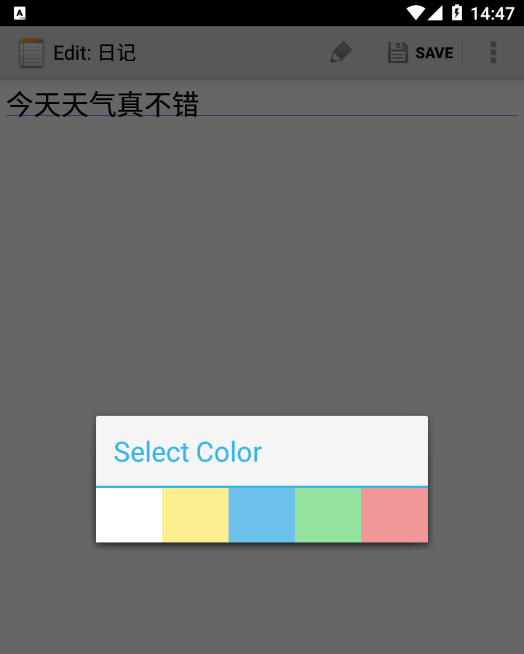


###### 3）点击后，背景会切换成选择的颜色

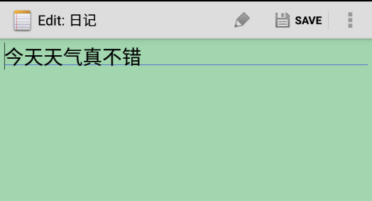


###### 4）在初始界面和搜索界面中的笔记背景也会切换成选择的颜色

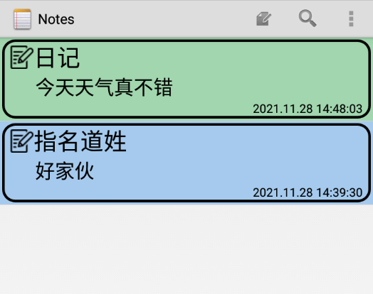

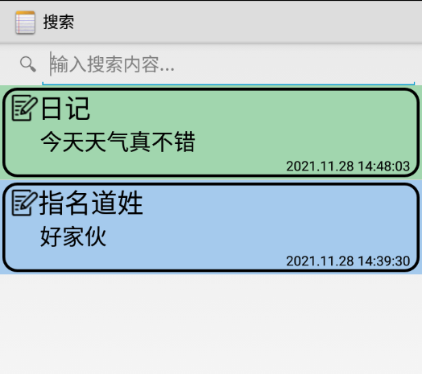


#### 4.UI美化

##### 实现效果：

###### 1)在笔记的标题左侧添加了笔记图标

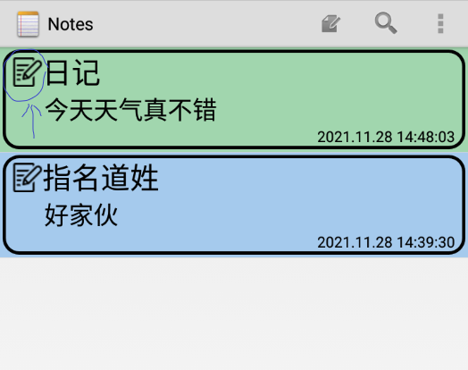


###### 2）在原有的基础上，补充显示笔记的内容


###### 3）为每个笔记添加边框

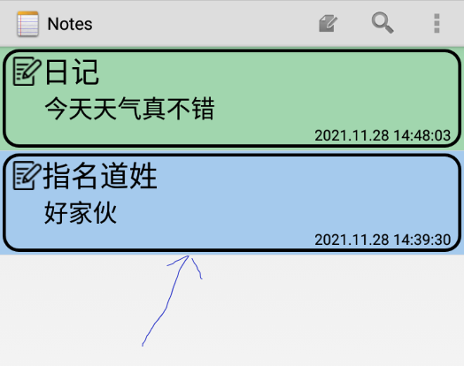


###### 4）调整字体大小和文本位置，使笔记排版看起来更舒适

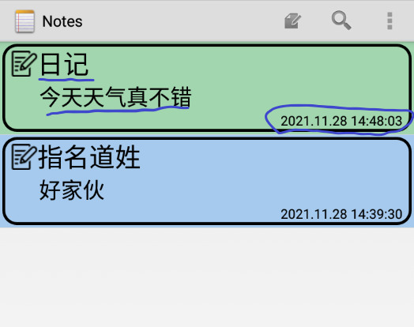


### 二、项目代码分析及源码

#### 1.添加笔记时间戳

##### 1）往数据库中添加COLUMN_NAME_MODIFICATION_DATE属性

```
public void onCreate(SQLiteDatabase db) {
    db.execSQL("CREATE TABLE " + NotePad.Notes.TABLE_NAME + " ("
            + NotePad.Notes._ID + " INTEGER PRIMARY KEY,"
            + NotePad.Notes.COLUMN_NAME_TITLE + " TEXT,"
            + NotePad.Notes.COLUMN_NAME_NOTE + " TEXT,"
            + NotePad.Notes.COLUMN_NAME_CREATE_DATE + " INTEGER,"
            + NotePad.Notes.COLUMN_NAME_MODIFICATION_DATE + " INTEGER,"//修改时间
            + NotePad.Notes.COLUMN_NAME_BACK_COLOR + " INTEGER" //数据库增加color属性
            + ");");
}
```

##### 2）创建时显示的时间在NotePadProvider的insert函数实现

```
// Gets the current system time in milliseconds
Long now = Long.valueOf(System.currentTimeMillis());

// If the values map doesn't contain the creation date, sets the value to the current time.
if (values.containsKey(NotePad.Notes.COLUMN_NAME_CREATE_DATE) == false) {
    values.put(NotePad.Notes.COLUMN_NAME_CREATE_DATE, now);
}

// If the values map doesn't contain the modification date, sets the value to the current time.
if (values.containsKey(NotePad.Notes.COLUMN_NAME_MODIFICATION_DATE) == false) {
    values.put(NotePad.Notes.COLUMN_NAME_MODIFICATION_DATE, now);
}
```

##### 3）因为在未处理前，显示的时间是一串连续数字，所以在NoteList的onCreate函数中用SimpleAdapter.ViewBinder使得显示时间的格式是我们需要的

```
SimpleCursorAdapter.ViewBinder viewBinder=new SimpleCursorAdapter.ViewBinder() {
    @Override
    public boolean setViewValue(View view, Cursor cursor, int i)
    {
        //设置时间
        if(cursor.getColumnIndex(NotePad.Notes.COLUMN_NAME_MODIFICATION_DATE)==i){

            TextView textView1=(TextView)view;
            SimpleDateFormat format = new SimpleDateFormat("yyyy.MM.dd HH:mm:ss",Locale.CHINA);
            Date date=new Date(cursor.getLong(i));
            String time=format.format(date);
            Log.d("TIME", "onCreate1:"+time);
            textView1.setText(time);

            return true;
        }
        return false;
    }
};
adapter.setViewBinder(viewBinder);
```

##### 4）在notelist_item.xml中添加一个TexView用于显示时间戳

```
<TextView xmlns:android="http://schemas.android.com/apk/res/android"
    android:id="@android:id/text2"
    android:layout_width="match_parent"
    android:layout_height="wrap_content"
    android:textAppearance="?android:attr/textAppearanceLarge"
    android:background="@drawable/color_select"
    android:gravity="center_vertical|right"
    android:textSize="15dp"
    android:paddingLeft="8dp"
    android:paddingRight="8dp"
    android:singleLine="true" />
```

##### 5）在NoteList的数据定义中添加修改时间

```
private static final String[] PROJECTION = new String[] {
        NotePad.Notes._ID,
        NotePad.Notes.COLUMN_NAME_TITLE, // 笔记标题
        NotePad.Notes.COLUMN_NAME_NOTE, //笔记内容
        NotePad.Notes.COLUMN_NAME_MODIFICATION_DATE, //笔记修改时间
        NotePad.Notes.COLUMN_NAME_BACK_COLOR, //显示笔记背景颜色
};
```

##### 6）装配的时候需要装配相应的日期，所以dataColumns,viewIDs这两个参数需要加入时间

```
String[] dataColumns = {
        NotePad.Notes.COLUMN_NAME_TITLE,//笔记标题
        NotePad.Notes.COLUMN_NAME_NOTE,//笔记内容
        NotePad.Notes.COLUMN_NAME_MODIFICATION_DATE//笔记修改时间
};

// The view IDs that will display the cursor columns, initialized to the TextView in noteslist_item.xml
int[] viewIDs = {
        android.R.id.text1,
        R.id.in_note,
        android.R.id.text2};
```

##### 7）然后使用SimpleCursorAdapter来进行装配，时间就会显示在相应的条目上

##### （这里我使用的是我另外设置的MyCursorAdapter继承SimpleCursorAdapter，具体内容会在实现背景颜色切换的时候提到）

```
// Creates the backing adapter for the ListView.
MyCursorAdapter adapter
        = new MyCursorAdapter(
        this,                             // The Context for the ListView
        R.layout.noteslist_item,          // Points to the XML for a list item
        cursor,                           // The cursor to get items from
        dataColumns,
        viewIDs
);
```


#### 2.笔记查询

##### 1）在list_options_menu.xml添加搜索组件

```
<item
    android:id="@+id/menu_search"
    android:title="@string/menu_search"
    android:icon="@android:drawable/ic_search_category_default"
    android:showAsAction="always">
</item>
```

##### 2)布局搜索页面，在layout中新建一个note_search_list文件，其中SearchView和ListView分别用来实现搜索功能和显示搜索出来的条目

```
<LinearLayout xmlns:android="http://schemas.android.com/apk/res/android"
    android:orientation="vertical"
    android:layout_width="match_parent"
    android:layout_height="match_parent">
    <SearchView
        android:id="@+id/search_view"
        android:layout_width="match_parent"
        android:layout_height="wrap_content"
        android:iconifiedByDefault="false"
        android:queryHint="输入搜索内容..."
        android:layout_alignParentTop="true">
    </SearchView>

    <ListView
        android:id="@android:id/list"
        android:layout_width="match_parent"
        android:layout_height="wrap_content"></ListView>

</LinearLayout>
```

##### 3）新建一个名为NoteSearch的java文件，在里面实现查询按钮的监听器、查询列表的监听器以及查询界面的初始化

```
public class NoteSearch extends ListActivity implements SearchView.OnQueryTextListener {

    private static final String[] PROJECTION = new String[] {
            NotePad.Notes._ID, //
            NotePad.Notes.COLUMN_NAME_TITLE, // 笔记标题
            NotePad.Notes.COLUMN_NAME_NOTE, //笔记内容
            NotePad.Notes.COLUMN_NAME_MODIFICATION_DATE, //笔记修改时间
            NotePad.Notes.COLUMN_NAME_BACK_COLOR, //笔记背景颜色
    };

    @Override
    protected void onCreate(Bundle savedInstanceState) {
        super.onCreate(savedInstanceState);
        setContentView(R.layout.note_search_list);

        Intent intent = getIntent();

        if (intent.getData() == null) {
            intent.setData(NotePad.Notes.CONTENT_URI);
        }
        SearchView searchview = (SearchView)findViewById(R.id.search_view);
        //为查询文本框注册监听器
        searchview.setOnQueryTextListener(NoteSearch.this);

    }

    @Override
    public boolean onQueryTextSubmit(String query) {

        return false;

    }

    @Override
    public boolean onQueryTextChange(String newText) {

        String selection = NotePad.Notes.COLUMN_NAME_TITLE + " Like ? ";

        String[] selectionArgs = { "%"+newText+"%" };

        Cursor cursor = managedQuery(
                getIntent().getData(),
                PROJECTION,
                selection,
                selectionArgs,
                NotePad.Notes.DEFAULT_SORT_ORDER
        );

        String[] dataColumns = {
                NotePad.Notes.COLUMN_NAME_TITLE, //笔记标题
                NotePad.Notes.COLUMN_NAME_NOTE, //笔记内容
                NotePad.Notes.COLUMN_NAME_MODIFICATION_DATE //笔记修改时间
        };

        int[] viewIDs = {
                android.R.id.text1,
                R.id.in_note, //显示笔记内容的组件名
                android.R.id.text2 };

        MyCursorAdapter adapter = new MyCursorAdapter(
                this,
                R.layout.noteslist_item,
                cursor,
                dataColumns,
                viewIDs

        );

        //显示时间格式
        SimpleCursorAdapter.ViewBinder viewBinder=new SimpleCursorAdapter.ViewBinder() {
            @Override
            public boolean setViewValue(View view, Cursor cursor, int i)
            {
                if(cursor.getColumnIndex(NotePad.Notes.COLUMN_NAME_MODIFICATION_DATE)==i){

                    TextView textView1=(TextView)view;
                    SimpleDateFormat format = new SimpleDateFormat("yyyy.MM.dd HH:mm:ss", Locale.CHINA);
                    Date date=new Date(cursor.getLong(i));
                    String time=format.format(date);
                    Log.d("TIME", "onCreate1:"+time);
                    textView1.setText(time);
                    return true;
                }
                return false;
            }
        };
        adapter.setViewBinder(viewBinder);

        setListAdapter(adapter);
        return true;

    }

    @Override
    protected void onListItemClick(ListView l, View v, int position, long id) {
        Uri uri = ContentUris.withAppendedId(getIntent().getData(), id);
        String action = getIntent().getAction();

        if (Intent.ACTION_PICK.equals(action) || Intent.ACTION_GET_CONTENT.equals(action)) {
            setResult(RESULT_OK, new Intent().setData(uri));
        } else {
            startActivity(new Intent(Intent.ACTION_EDIT, uri));
        }
    }
}
```

##### 4）在AndroidManifest.xml添加搜索声明

```
<activity
    android:name="NoteSearch"
    android:label="@string/title_notes_search">
</activity>
```

##### 5）最后在NoteList的onOptionsItemSelected函数中增加一个case用于搜索，笔记搜索功能就完成了

```
case R.id.menu_search:
    Intent intent = new Intent();
    intent.setClass(NotesList.this,NoteSearch.class);
    NotesList.this.startActivity(intent);
    return true;
```


#### 3.笔记背景颜色切换

##### 1）在NotePad中设置COLUMN_NAME_BACK_COLOR = "color"，用于在数据库中添加字段“color“，设置颜色编号

```
public static final String COLUMN_NAME_BACK_COLOR = "color";
public static final int DEFAULT_COLOR = 0;
public static final int YELLOW_COLOR = 1;
public static final int BLUE_COLOR = 2;
public static final int GREEN_COLOR = 3;
public static final int RED_COLOR = 4;
```

##### 2）在NotePadProvider中修改创建数据库的语句，添加+ NotePad.Notes.COLUMN_NAME_BACK_COLOR + " INTEGER"

```
public void onCreate(SQLiteDatabase db) {
    db.execSQL("CREATE TABLE " + NotePad.Notes.TABLE_NAME + " ("
            + NotePad.Notes._ID + " INTEGER PRIMARY KEY,"
            + NotePad.Notes.COLUMN_NAME_TITLE + " TEXT,"
            + NotePad.Notes.COLUMN_NAME_NOTE + " TEXT,"
            + NotePad.Notes.COLUMN_NAME_CREATE_DATE + " INTEGER,"
            + NotePad.Notes.COLUMN_NAME_MODIFICATION_DATE + " INTEGER,"//数据库增加修改时间
            + NotePad.Notes.COLUMN_NAME_BACK_COLOR + " INTEGER" //数据库增加color属性
            + ");");
}
```

##### 3）在NotePadProvider的static中实例化和设置静态对象的块

```
sNotesProjectionMap.put(
        NotePad.Notes.COLUMN_NAME_BACK_COLOR,
        NotePad.Notes.COLUMN_NAME_BACK_COLOR);
```

##### 4）在NotePadProvider的insert中增加创建新笔记时需要执行的语句，给每条笔记设置默认背景颜色

```
// 笔记背景默认为白色
if (values.containsKey(NotePad.Notes.COLUMN_NAME_BACK_COLOR) == false) {
    values.put(NotePad.Notes.COLUMN_NAME_BACK_COLOR, NotePad.Notes.DEFAULT_COLOR);
}
```

##### 5）笔记列表显示时从数据库中读取color的代码，所以在NoteList和NoteSearch中的PROJECTION添加color属性

```
private static final String[] PROJECTION = new String[] {
        NotePad.Notes._ID,
        NotePad.Notes.COLUMN_NAME_TITLE, // 笔记标题
        NotePad.Notes.COLUMN_NAME_NOTE, //笔记内容
        NotePad.Notes.COLUMN_NAME_MODIFICATION_DATE, //笔记修改时间
        NotePad.Notes.COLUMN_NAME_BACK_COLOR, //显示笔记背景颜色
};
```

##### 6）新建一个MyCursorAdapter继承SimpleCursorAdapter，使用bindView将颜色填充到ListView

```
public class MyCursorAdapter extends SimpleCursorAdapter {
    public MyCursorAdapter(Context context, int layout, Cursor c,
                           String[] from, int[] to) {
        super(context, layout, c, from, to);
    }
    @Override
    public void bindView(View view, Context context, Cursor cursor){
        super.bindView(view, context, cursor);
        //从数据库中读取的先前存入的笔记背景颜色的编码，再设置笔记的背景颜色
        int x = cursor.getInt(cursor.getColumnIndex(NotePad.Notes.COLUMN_NAME_BACK_COLOR));
        switch (x){
            case NotePad.Notes.YELLOW_COLOR:
                view.setBackgroundColor(Color.rgb(247, 216, 133));
                break;
            case NotePad.Notes.BLUE_COLOR:
                view.setBackgroundColor(Color.rgb(165, 202, 237));
                break;
            case NotePad.Notes.GREEN_COLOR:
                view.setBackgroundColor(Color.rgb(161, 214, 174));
                break;
            case NotePad.Notes.RED_COLOR:
                view.setBackgroundColor(Color.rgb(244, 149, 133));
                break;
            default:
                view.setBackgroundColor(Color.rgb(255, 255, 255));
                break;
        }
    }
}
```

##### 7）将NoteList和NoteSearch里的适配器改为MyCursorAdapter

```
MyCursorAdapter adapter
        = new MyCursorAdapter(
        this,                             // The Context for the ListView
        R.layout.noteslist_item,          // Points to the XML for a list item
        cursor,                           // The cursor to get items from
        dataColumns,
        viewIDs
);
```

##### 8）最后在layout中新建一个note_color.xml，用tableLayout实现对颜色选择按钮的布局，笔记背景颜色切换功能完成

```
<TableLayout xmlns:android="http://schemas.android.com/apk/res/android"
    android:layout_width="match_parent"
    android:layout_height="match_parent">

    <TableRow>
        <ImageButton
            android:id="@+id/color_white"
            android:layout_width="50dp"
            android:layout_height="50dp"
            android:layout_weight="1"
            android:background="#ffffff"
            android:onClick="white" />

        <ImageButton
            android:id="@+id/color_yellow"
            android:layout_width="50dp"
            android:layout_height="50dp"
            android:layout_weight="1"
            android:background="#fdef90"
            android:onClick="yellow" />

        <ImageButton
            android:id="@+id/color_blue"
            android:layout_width="50dp"
            android:layout_height="50dp"
            android:layout_weight="1"
            android:background="#6dc1ed"
            android:onClick="blue" />

        <ImageButton
            android:id="@+id/color_green"
            android:layout_width="50dp"
            android:layout_height="50dp"
            android:layout_weight="1"
            android:background="#94e49f"
            android:onClick="green" />

        <ImageButton
            android:id="@+id/color_red"
            android:layout_width="50dp"
            android:layout_height="50dp"
            android:layout_weight="1"
            android:background="#f19696"
            android:onClick="red" />
    </TableRow>
</TableLayout>
```


#### 4.UI美化

##### 1）在notelist_item中笔记标题对应的TextView组件添加android:drawableLeft="@drawable/notes"，实现笔记标题左侧显示笔记图标

```
<TextView xmlns:android="http://schemas.android.com/apk/res/android"
    android:id="@android:id/text1"
    android:layout_width="match_parent"
    android:layout_height="wrap_content"
    android:drawableLeft="@drawable/notes"
    android:textAppearance="?android:attr/textAppearanceLarge"
    android:background="@drawable/color_select"
    android:gravity="center_vertical"
    android:textSize="30dp"
    android:paddingLeft="8dp"
    android:paddingRight="8dp"
    android:singleLine="true"
    />
```

##### 2)接下来要实现显示笔记内容，因为代码中已经有COLUMN_NAME_NOTE，所以我们只需要往NoteList和NoteSearch中的PROJECTION中添加COLUMN_NAME_NOTE，以及往dataColumns和viewIDs中分别添加COLUMN_NAME_NOTE和显示笔记内容的组件id即可

```
String[] dataColumns = {
        NotePad.Notes.COLUMN_NAME_TITLE,//笔记标题
        NotePad.Notes.COLUMN_NAME_NOTE,//笔记内容
        NotePad.Notes.COLUMN_NAME_MODIFICATION_DATE//笔记修改时间
};
// The view IDs that will display the cursor columns, initialized to the TextView in
// noteslist_item.xml
int[] viewIDs = {
        android.R.id.text1,
        R.id.in_note,
        android.R.id.text2};
```

##### 3）在layout中新建文件border.xml，用于设置笔记边框

```
<shape xmlns:android="http://schemas.android.com/apk/res/android">
<!--    设置边框线的粗细和颜色-->
    <stroke
        android:width="3dp"
        android:color="#000000" />

    <padding
        android:bottom="3dp"
        android:left="3dp"
        android:right="3dp"
        android:top="3dp" />
<!--    圆角半径-->
    <corners android:radius="15dp" />

</shape>
```

##### 4）设置notelist_item的LinearLayout的background="@drawable/border"，即可实现笔记边框

```
<LinearLayout
    xmlns:android="http://schemas.android.com/apk/res/android"
    android:orientation="vertical"
    android:layout_width="match_parent"
    android:layout_height="wrap_content"
    android:background="@drawable/border"
    >

    <LinearLayout
        android:layout_width="match_parent"
        android:layout_height="wrap_content"
        android:orientation="vertical"
        android:background="@drawable/border">
```

##### 5）实现布局优化，设置notelist_item.xml中各组件的gravity，textSize，paddingLeft，paddingRight属性，以及border.xml中的stroke，padding，corners中的属性即可完成

###### notelist_item:

```
android:gravity="center_vertical|right"
android:textSize="15dp"
android:paddingLeft="8dp"
android:paddingRight="8dp"
```

###### border:

```
<stroke
        android:width="3dp"
        android:color="#000000" />

    <padding
        android:bottom="3dp"
        android:left="3dp"
        android:right="3dp"
        android:top="3dp" />
<!--    圆角半径-->
    <corners android:radius="15dp" />
```
