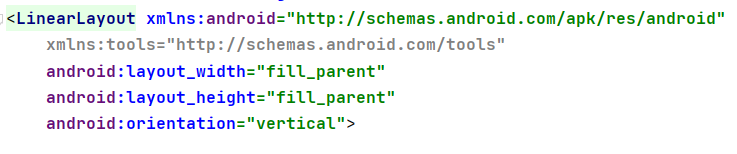
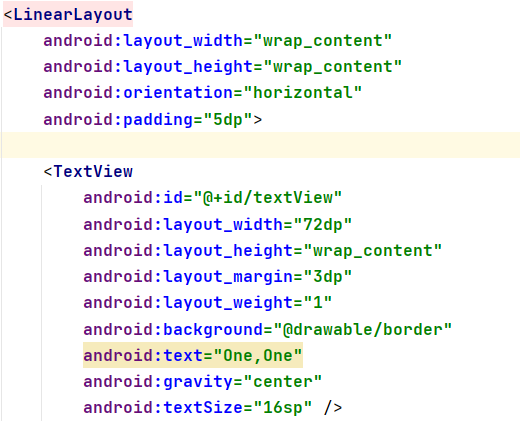
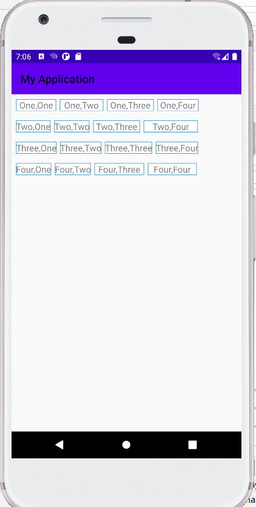
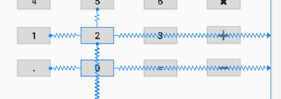
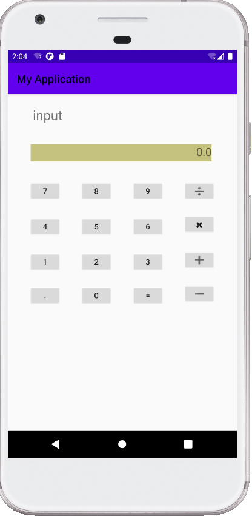
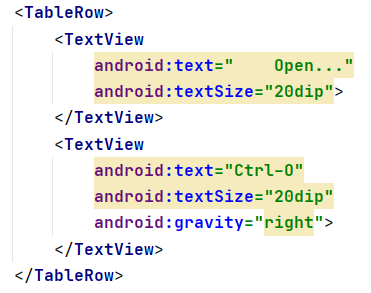
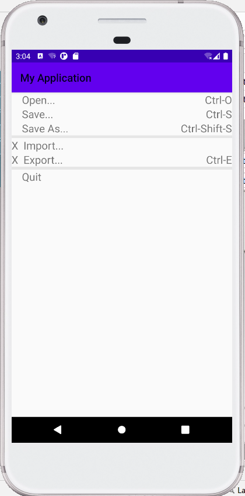

#  实验2    Android界面布局

## 一、线性布局

### 1.实验步骤

####   1.1让每行的第1个排成1列

####   1.2再分别以第一列中的每一个建立水平

### 关键代码：

### 2.实验结果

## 二、约束布局

### 1.实验步骤

####   1.1建立需要的元件  

####   1.2将每个元件的上下左右都连接起来

### 关键代码：

### 2.实验结果

## 三、表格布局

### 1.实验步骤

####   1.1使用TableRow将一行划分为两部分

####   1.2用线将布局分为3部分

### 关键代码：

### 2.实验结果

