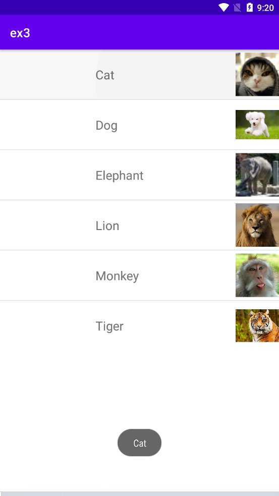
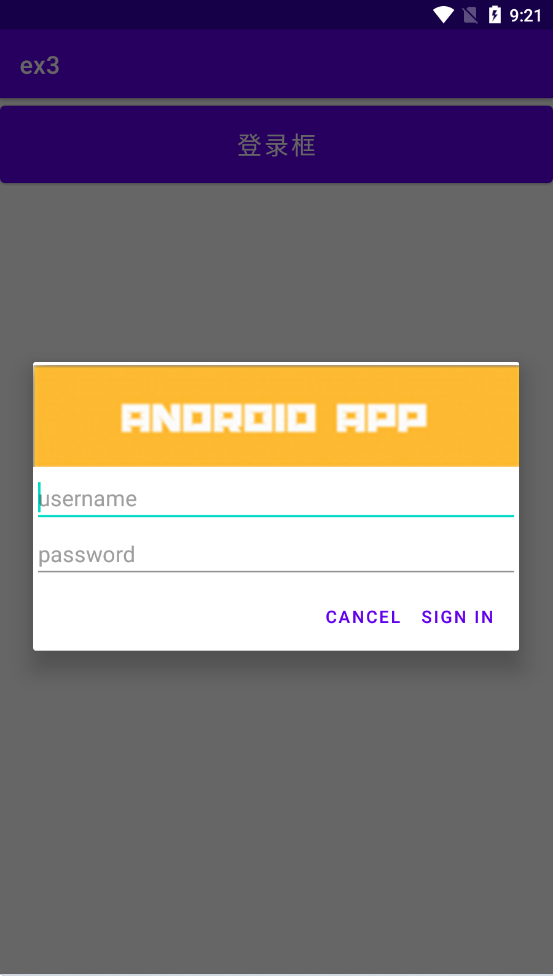
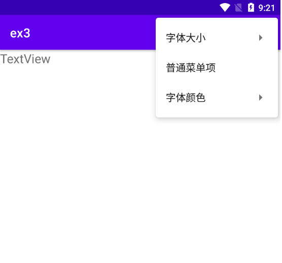
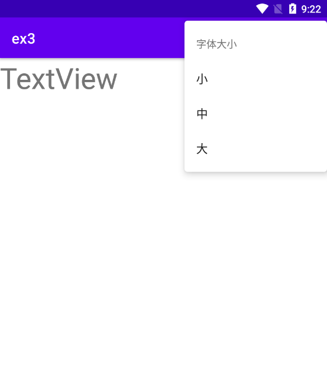
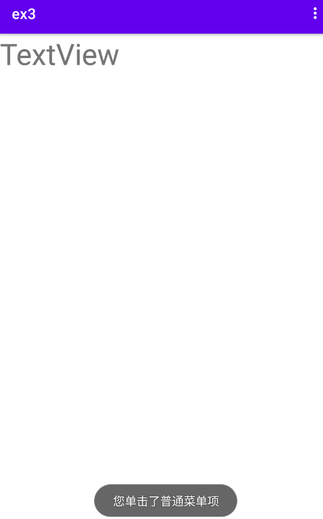
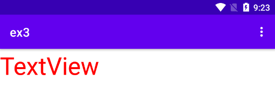
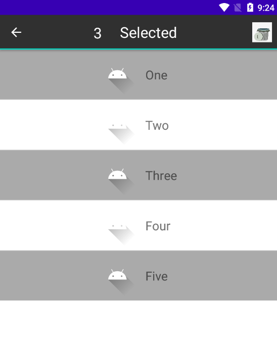

# 实验3  Android界面组件

## 一、Android ListView的用法

### 1.实验步骤

#### 1）在activity_main.xml文件中创建一个ListView

#### 2)   创建一个新的listview.xml文件，对列表项进行统一布局

#### 3）在MainActivity中构造适配器，使得列表项得以展示,并用Toast显示列表项的信息


### 2.效果截图




### 3.关键代码：（适配器）

```
List<Map<String, Object>> list = new ArrayList<>();
for(int i=0;i<ImageArr.length;i++){
    Map<String,Object> map=new HashMap<>();
    map.put("img",ImageArr[i]);
    map.put("name",nameArr[i]);
    list.add(map);
}
String[] from = {"img","name"};
int [] to = {R.id.item_img,R.id.item_title};
SimpleAdapter simpleAdapter=new SimpleAdapter(this,list,R.layout.listview,
        from,to);
ListView listView=findViewById(R.id.lv);
listView.setAdapter(simpleAdapter);
listView.setOnItemClickListener(new AdapterView.OnItemClickListener() {
    @Override
    public void onItemClick(AdapterView<?> parent, View view, int position, long id) {
        Toast.makeText(MainActivity.this,nameArr[position],Toast.LENGTH_SHORT).show();
    }
});
```


## 二、创建自定义布局的AlertDialog

### 1.实验步骤

#### 1）创建文件login.xml，在里面创建登录框的布局

#### 2）创建文件activity_title2.xml，在里面设置一个按钮，点击后会弹出登录框

#### 3）创建文件activity文件title2，调 用 AlertDialog.Builder 对 象 上 的 setView() 将 布 局 添 加 到 AlertDialog，并对登录框进行调整

### 2.效果截图



### 3.关键代码：

```
public class title2 extends AppCompatActivity {

    LinearLayout login;
    @Override
    protected void onCreate(Bundle savedInstanceState) {
        super.onCreate(savedInstanceState);
        setContentView(R.layout.activity_title2);
        Button btn1 = (Button) findViewById(R.id.button1);
        btn1.setOnClickListener(new View.OnClickListener() {

            AlertDialog.Builder dialog = new AlertDialog.Builder(title2.this);
            @Override
            public void onClick(View v) {
                login = (LinearLayout) getLayoutInflater().inflate(R.layout.login, null);
                dialog.setIcon(R.drawable.header_logo)
                        .setView(login)
                        .setNegativeButton("Cancel", (dialog1, which) -> {})
                        .setPositiveButton("Sign in",(dialog1, which) -> {})
                        .create().show();
            }
        });
    }
}
```


## 三、使用XML定义菜单

### 1.实验步骤

#### 1）创建menu文件menu_main，设置菜单及内容

#### 2）创建xml文件activity_title3，设置一个TextView，用以显示文本

#### 3）创建activity文件title3，在文件中使用activity_title3和menu_main文件，并设置点击效果


### 2.效果截图

#### 1）总体显示



#### 2）字体大小（图中显示为大）



#### 3)普通菜单项



#### 4)字体颜色（图中显示为红色）




### 3.关键代码：

```
public class title3 extends AppCompatActivity {

    private TextView textView;

    @Override
    protected void onCreate(Bundle savedInstanceState) {
        super.onCreate(savedInstanceState);
        setContentView(R.layout.activity_title3);
        textView = (TextView) findViewById(R.id.textView);
        registerForContextMenu(textView);
    }

    @Override
    //装填R.Menu.menu_main菜单，并添加到menu中
    public boolean onCreateOptionsMenu(Menu menu){
        MenuInflater inflater = new MenuInflater(this);
        inflater.inflate(R.menu.menu_main,menu);
        return super.onCreateOptionsMenu(menu);
    }

    //上下文菜单中菜单项被单击时，触发该方法
    @Override
    public boolean onOptionsItemSelected(MenuItem item) {
        //勾选菜单项
        item.setChecked(true);
        switch (item.getItemId()){
            case R.id.red_font:
                item.setChecked(true);
                textView.setTextColor(Color.RED);
                break;
            case R.id.black_font:
                item.setChecked(true);
                textView.setTextColor(Color.BLACK);
                break;
            case R.id.font_10:
                textView.setTextSize(10 * 2);
                break;
            case R.id.font_16:
                textView.setTextSize(16 * 2);
                break;
            case R.id.font_20:
                textView.setTextSize(20 * 2);
                break;
            case R.id.sim:
                Toast.makeText(title3.this,"您单击了普通菜单项",Toast.LENGTH_SHORT)
                        .show();
                break;
        }
        return true;
    }
}
```


## 四、创建上下文操作模式(ActionMode)的上下文菜单

### 1.实验步骤

#### 1）创建activity_title4.xml文件，在里面创建一个ListView

#### 2)创建文件listview_title4，用线性布局对列表项进行统一布局

#### 3）创建menu文件menu_main4.xml，用于显示垃圾清除图标

#### 4）创建activity文件title4，在onCreate中设置适配器用于显示列表项，并使用ActionMode对上下文菜单进行设置


### 2.效果截图



### 3.关键代码：（ActionMode）

```
listView.setChoiceMode(ListView.CHOICE_MODE_MULTIPLE_MODAL);
        listView.setMultiChoiceModeListener(new AbsListView.MultiChoiceModeListener() {

            @Override
            public void onItemCheckedStateChanged(ActionMode mode, int position,
                                                  long id, boolean checked) {
                updateCount();
                mode.invalidate();
            }

            @Override
            public boolean onActionItemClicked(ActionMode mode, MenuItem item) {
                // Respond to clicks on the actions in the CAB
                int id = item.getItemId();
                return false;
            }

            @Override
            public boolean onCreateActionMode(ActionMode mode, Menu menu) {
                mode.getMenuInflater().inflate(R.menu.menu_main4,menu);
                if(numView==null){
                    numView = LayoutInflater.from(title4.this).inflate(R.layout.title4_1,null);
                    count = (TextView) numView.findViewById(R.id.txt1);
                }
                mode.setCustomView(numView);
                return true;
            }

            @Override
            public void onDestroyActionMode(ActionMode mode) {

            }

            @Override
            public boolean onPrepareActionMode(ActionMode mode, Menu menu) {
               
                return false;
            }

            public void updateCount(){
                int n = listView.getCheckedItemCount();
                count.setText(n+"");
            }
        });
```


