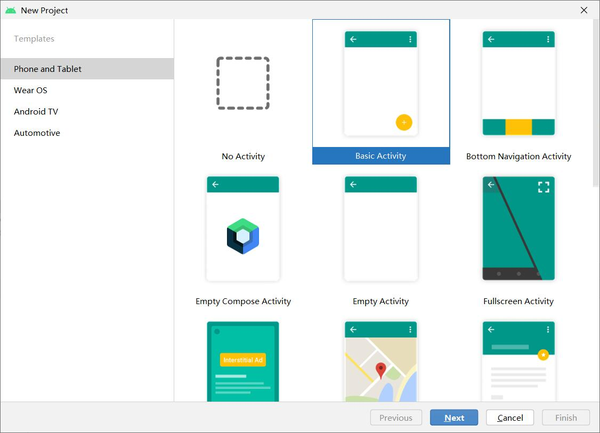
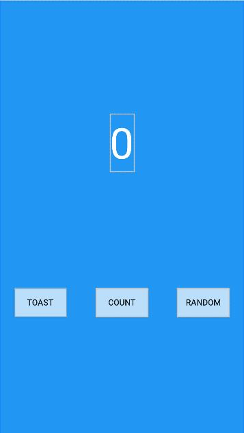
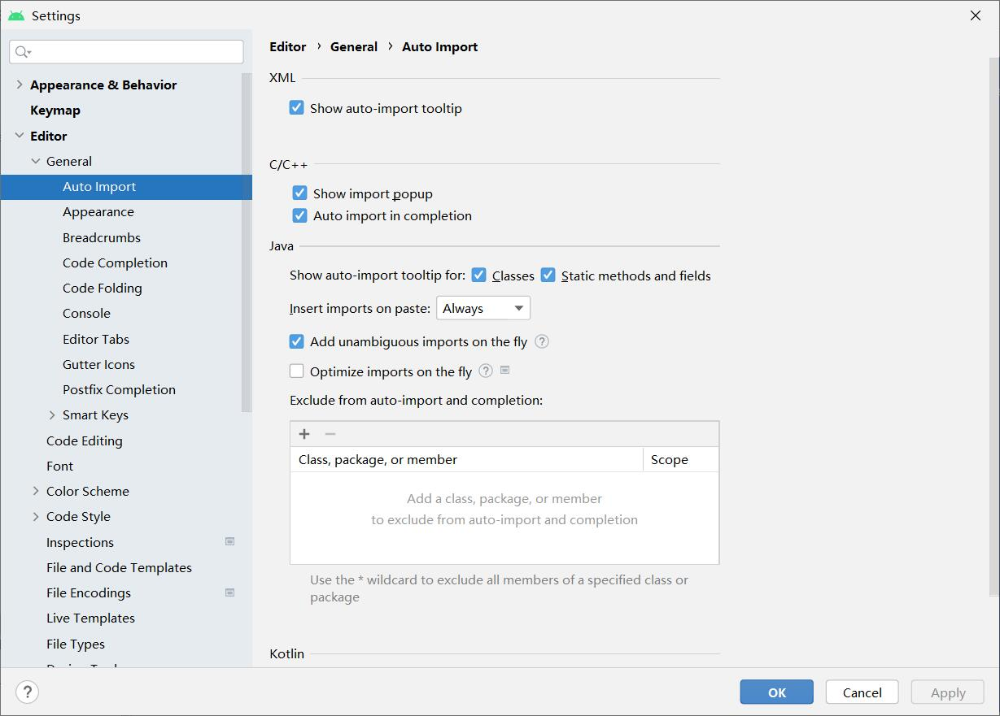
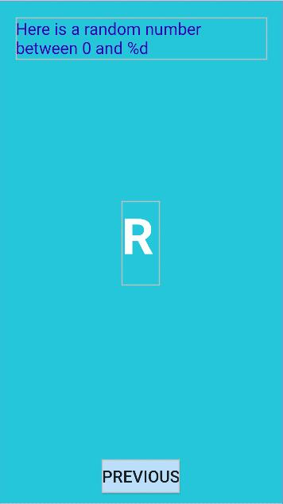
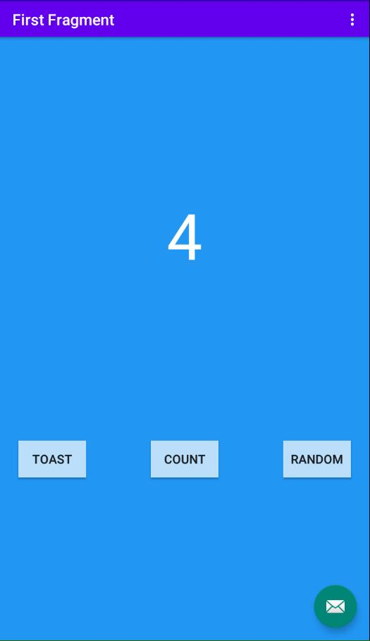
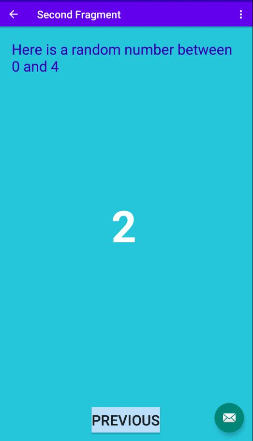

# 实验二   创建首个Kotlin应用

## 实验步骤

1.打开Android Studio，选择Projects>New Project，然后选择Basic Activity.



2.调整fragment_first.xml的布局，调整后代码如下：

```
<?xml version="1.0" encoding="utf-8"?>
<androidx.constraintlayout.widget.ConstraintLayout xmlns:android="http://schemas.android.com/apk/res/android"
    xmlns:app="http://schemas.android.com/apk/res-auto"
    xmlns:tools="http://schemas.android.com/tools"
    android:layout_width="match_parent"
    android:layout_height="match_parent"
    android:background="@color/screenBackground"
    tools:context=".FirstFragment">

    <TextView
        android:id="@+id/textview_first"
        android:layout_width="wrap_content"
        android:layout_height="wrap_content"
        android:text="0"
        android:textColor="@color/white"
        android:textSize="72sp"
        app:layout_constraintBottom_toBottomOf="parent"
        app:layout_constraintEnd_toEndOf="parent"
        app:layout_constraintStart_toStartOf="parent"
        app:layout_constraintTop_toTopOf="parent"
        app:layout_constraintVertical_bias="0.3" />

    <Button
        android:id="@+id/random_button"
        android:layout_width="wrap_content"
        android:layout_height="wrap_content"
        android:layout_marginEnd="24dp"
        android:background="@color/buttonBackground"
        android:text="@string/RANDOM"
        app:layout_constraintBottom_toBottomOf="parent"
        app:layout_constraintEnd_toEndOf="parent"
        app:layout_constraintTop_toBottomOf="@+id/textview_first" />

    <Button
        android:id="@+id/toast_button"
        android:layout_width="wrap_content"
        android:layout_height="wrap_content"
        android:layout_marginStart="24dp"
        android:background="@color/buttonBackground"
        android:text="@string/TOAST"
        app:layout_constraintBottom_toBottomOf="parent"
        app:layout_constraintStart_toStartOf="parent"
        app:layout_constraintTop_toBottomOf="@+id/textview_first" />

    <Button
        android:id="@+id/count_button"
        android:layout_width="wrap_content"
        android:layout_height="wrap_content"
        android:text="@string/COUNT"
        android:background="@color/buttonBackground"
        app:layout_constraintBottom_toBottomOf="parent"
        app:layout_constraintEnd_toStartOf="@+id/random_button"
        app:layout_constraintStart_toEndOf="@+id/toast_button"
        app:layout_constraintTop_toBottomOf="@id/textview_first" />

</androidx.constraintlayout.widget.ConstraintLayout>
```

效果图如下：



3.设置代码自动补全。

Android Studio中，依次点击File>New Projects Settings>Settings for New Projects…，查找Auto Import选项，在Java和Kotlin部分，勾选Add Unambiguous Imports on the fly。


4.TOAST按钮添加一个toast消息

打开FirstFragment.kt文件，有三个方法：onCreateView，onViewCreated和onDestroyView，在onViewCreated方法中使用绑定机制设置按钮的响应事件

```
binding.randomButton.setOnClickListener {
    findNavController().navigate(R.id.action_FirstFragment_to_SecondFragment)
}
```

接下来，为TOAST按钮添加事件，使用**findViewById()**查找按钮id，代码如下：

```
view.findViewById<Button>(R.id.toast_button).setOnClickListener {
    // create a Toast with some text, to appear for a short time
    val myToast = Toast.makeText(context, "Hello Toast!", Toast.LENGTH_LONG)
    // show the Toast
    myToast.show()
}
```

5.使Count按钮更新屏幕的数字

向Count按钮添加事件响应，更新Textview的文本显示。
在FirstFragment.kt文件，为count_buttion按钮添加事件：

```
view.findViewById<Button>(R.id.count_button).setOnClickListener {
   countMe(view)
}
```

countMe()为自定义方法，以View为参数，每次点击增加数字1，具体代码为：

```
private fun countMe(view: View) {
   // Get the text view
   val showCountTextView = view.findViewById<TextView>(R.id.textview_first)

   // Get the value of the text view.
   val countString = showCountTextView.text.toString()

   // Convert value to a number and increment it
   var count = countString.toInt()
   count++

   // Display the new value in the text view.
   showCountTextView.text = count.toString()
}
```

6.完成第二界面的代码

（1）向界面添加TextView显示随机数，代码如下：

```
<TextView
   android:id="@+id/textview_header"
   android:layout_width="0dp"
   android:layout_height="wrap_content"
   android:layout_marginStart="24dp"
   android:layout_marginLeft="24dp"
   android:layout_marginTop="24dp"
   android:layout_marginEnd="24dp"
   android:layout_marginRight="24dp"
   android:text="@string/random_heading"
   android:textColor="@color/colorPrimaryDark"
   android:textSize="24sp"
   app:layout_constraintEnd_toEndOf="parent"
   app:layout_constraintStart_toStartOf="parent"
   app:layout_constraintTop_toTopOf="parent" />
```

效果如下：



（2）启用SafeArgs

SafeArgs 是一个 gradle 插件，它可以帮助您在导航图中输入需要传递的数据信息，作用类似于Activity之间传递数据的Bundle。

首先打开 Gradle Scripts > build.gradle (Project: My First App)
找到dependencies的buildscript部分，添加如下代码

```
buildscript {
    dependencies {
        def nav_version = "2.4.2"
        classpath("androidx.navigation:navigation-safe-args-gradle-plugin:$nav_version")
    }
}
```

接着打开 Gradle Scripts > build.gradle (Module: app)

在plugins开头的代码下添加一行

```
id ("androidx.navigation.safeargs")
```

Android Studio开始同步依赖库，重新生成工程Build > Make Project

（3）创建导航动作的参数

1. 打开导航视图，点击`FirstFragment`，查看其属性。
2. 在`Actions`栏中可以看到导航至`SecondFragment`
3. 同理，查看`SecondFragment`的属性栏
4. 点击Arguments **+**符号
5. 弹出的对话框中，添加参数myArg，类型为整型Integer

（4）FirstFragment添加代码，向SecondFragment发数据

初始应用中，点击FirstFragment的Next/Random按钮将跳转到第二个页面，但没有传递数据。在本步骤中将获取当前TextView中显示的数字并传输至SecondFragment。

打开FirstFragment.kt源代码文件
找到onViewCreated()方法，该方法在onCreateView方法之后被调用，可以实现组件的初始化。找到Random按钮的响应代码，注释掉原先的事件处理代码
实例化TextView，获取TextView中文本并转换为整数值

```
val showCountTextView = view.findViewById<TextView>(R.id.textview_first)
val currentCount = showCountTextView.text.toString().toInt()
```

将`currentCount`作为参数传递给actionFirstFragmentToSecondFragment()

```
val action = FirstFragmentDirections.actionFirstFragmentToSecondFragment(currentCount)
```

添加导航事件代码

```
findNavController().navigate(action)
```

运行代码，点击FirstFragment的Count按钮，然后点击Random按钮，可以看到SecondFragment在头部的TextView已经显示正确的数字，但是屏幕中间还未出现随机数显示

（5）添加SecondFragment的代码

导入navArgs包

```
import androidx.navigation.fragment.navArgs
```

onViewCreated()代码之前添加一行

```
val args: SecondFragmentArgs by navArgs()
```

onViewCreated()中获取传递过来的参数列表，提取count数值，并在textview_header中显示

```
val count = args.myArg
val countText = getString(R.string.random_heading, count)
view.findViewById<TextView>(R.id.textview_header).text = countText
```

根据count值生成随机数

```
val random = java.util.Random()
var randomNumber = 0
if (count > 0) {
   randomNumber = random.nextInt(count + 1)
}
```

textview_random中显示count值

```
view.findViewById<TextView>(R.id.textview_random).text = randomNumber.toString()
```

运行应用程序，查看运行结果。


最终实现效果：




