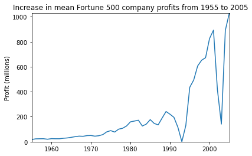

# 实验四 Jupyter Notebook实践

## 一、掌握Notebook工具的基本原理

1.创建一个新的Notebook
新建一个Notebook Python 3 (ipykernel)，生成了一个Untitled.ipynb文件。.ipynb文件即所谓的一个Notebook，实际是基于JSON格式的文本文件，
并且包含元数据(“Edit > Edit Notebook Metadata”)。新建的Notebook的界面大致如下：


这里有两个关键元素cell和kernal

cell: 文本或者代码执行单元，由kernel执行。
kernel: 计算引擎，执行cell的文本或者代码，本文基于Python 3 ipykernel引擎

2.cell
主要包含两种类型的cell：

代码cell：包含可被kernel执行的代码，执行之后在下方显示输出。
Markdown cell：书写Markdown标记语言的cell。

3.kernel
每个notebook都基于一个内核运行，当执行cell代码时，代码将在内核当中运行，运行的结果会显示在页面上。Kernel中运行的状态在整个文档中是延续的，可以跨越所有的cell。这意思着在一个Notebook某个cell定义的函数或者变量等，在其他cell也可以使用。

# 二、学习Python基本语法，完成选择排序程序

实现效果：


# 三、完成Python数据分析的例子


```python
%matplotlib inline
import pandas as pd
import matplotlib.pyplot as plt
import seaborn as sns


df = pd.read_csv('fortune500.csv')
df.head()
df.tail()
df.columns = ['year', 'rank', 'company', 'revenue', 'profit']

print(len(df))
print(df.dtypes)
```

    25500
    year         int64
    rank         int64
    company     object
    revenue    float64
    profit      object
    dtype: object


```python
non_numberic_profits = df.profit.str.contains('[^0-9.-]')
df.loc[non_numberic_profits].head()

print(len(df.profit[non_numberic_profits]))

bin_sizes, _, _ = plt.hist(df.year[non_numberic_profits], bins=range(1955, 2006))

df = df.loc[~non_numberic_profits]
df.profit = df.profit.apply(pd.to_numeric)

print(len(df))
print(df.dtypes)
```

    369
    25131
    year         int64
    rank         int64
    company     object
    revenue    float64
    profit     float64
    dtype: object


    


```python

group_by_year = df.loc[:, ['year', 'revenue', 'profit']].groupby('year')
avgs = group_by_year.mean()
x = avgs.index
y1 = avgs.profit
def plot(x, y, ax, title, y_label):
    ax.set_title(title)
    ax.set_ylabel(y_label)
    ax.plot(x, y)
    ax.margins(x=0, y=0)

fig, ax = plt.subplots()
plot(x, y1, ax, 'Increase in mean Fortune 500 company profits from 1955 to 2005', 'Profit (millions)')


y2 = avgs.revenue
fig, ax = plt.subplots()
plot(x, y2, ax, 'Increase in mean Fortune 500 company revenues from 1955 to 2005', 'Revenue (millions)')
```



    


    


```python
def plot_with_std(x, y, stds, ax, title, y_label):
    ax.fill_between(x, y - stds, y + stds, alpha=0.2)
    plot(x, y, ax, title, y_label)
fig, (ax1, ax2) = plt.subplots(ncols=2)
title = 'Increase in mean and std Fortune 500 company %s from 1955 to 2005'
stds1 = group_by_year.std().profit.values
stds2 = group_by_year.std().revenue.values
plot_with_std(x, y1.values, stds1, ax1, title % 'profits', 'Profit (millions)')
plot_with_std(x, y2.values, stds2, ax2, title % 'revenues', 'Revenue (millions)')
fig.set_size_inches(14, 4)
fig.tight_layout()
```


    

